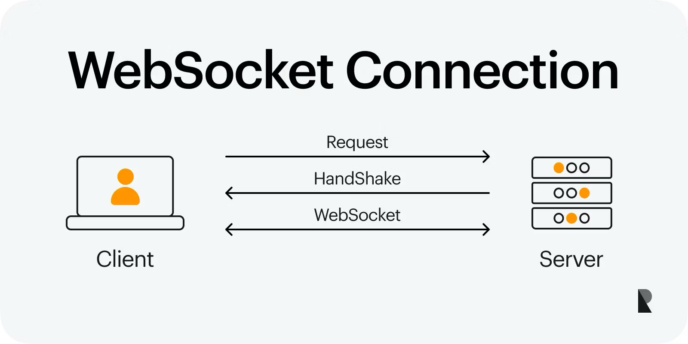

# DEV1002_Dating_app

# Features
- User's and user profile.
- Edit those profiles
- View other users based on interest filters
- Log in
- Message other users with online simple games
- match with users
- see who liked their user
- Interests, filter by interests 

# 2. Software Development Methodologies
## 2.1. Project management 

In this project, Agile methodology will be used. This methodology is an iteractive approach to manage and execute product development projects.

Agile project management breaks a project into smaller, manageable phases called sprints. Each sprint follows a cycle of planning, execution, and review, enabling teams to quickly adjust to changes and steadily refine the product. This means after every sprint, teams review, reflect and look back to see if there was anything that could be improved so they can adjust their strategy for the next sprint.

Cycle of agile methodology is demonstrated as follow:

This method requires teamwork, adaptability, and customer input to deliver consistent value throughout the project’s progression.

**Benefits of Agile methodology:**
Agile is most common in app and software projects because software changes a lot in short time, and the product needs to change with it.

That’s why linear plans like Waterfall don’t fit as well. Instead, our teams pick Agile for a few big reasons:

- Agile is adaptable:

You can change direction quickly without disrupting the flow of a project. In Waterfall, each phase depends on the last, so switching plans mid-way can break the timeline.

- Agile boosts teamwork:

Agile promotes frequent, direct communication and breaking down silos. Even with remote work, the idea is the same: talk often, share context, and solve problems together.

- Agile focuses on the customer:

Software teams can gather real user feedback fast (e.g., from cloud apps). The team can collaborate with customers to understand their needs, then prioritizing the right features that focus on customers' satisfaction. When those needs change, the software team can use Agile method to change to another direction for the software, or develop new projects. 

The diagram below explains how Agile methodology will be applied in this Dating Application project:

<Add a diagram here>
Planning (tools, packages required, ERD, UI design ) -> Set up file strucure -> Build CRUD API, middlewares, authentication, authorisation for: log in, set up profile, connect to other uses, messaging-> Build front end (user interface) -> test -> release -> feedback -> issues solved -> plan for game feature -> implement mini game API into messaging chat

For example:
- When development of main features of the app is completed and tested, app will be deployed and released to the market. These main features include: user setting up profile, users connecting to each other and messaging. After releasing, user feedbacks will be collected based on rating and reviews on app store, and app will be upgraded or debugged based on those reviews. New feature such as game playing in the chat window will be developed with consideration of those feedbacks as well.

## 2.2. Task management
Kanban is selected to be task management methodology for this project. 
Kanban is a visual framework within Agile project management. It uses a board-based system to track the status of tasks throughout the workflow. Each task is represented by a card, and workflow stages are shown as columns (e.g., Backlog, In Progress, Review, Done). As progress is made, team members move task cards from one column to the next, providing clear visibility into where each task sits in the development process.

**Benefits of Kanban method:**
- Planning flexibility: 

Using Kanban help team members to concentrate on the tasks currently in progress. When a task is finished, the next item is pulled from the backlog. Because only in-progress work is affected, the leader/ product owner can freely reprioritize the backlog without disrupting the team.

By keeping the highest-priority items at the top of the backlog, the team members can confidently pull the next task from backlog and consistently deliver the most value for the project. 

- Shorter time cycles:

Cycle time is the duration from when work starts to when it ships. By reducing cycle time, teams can forecast delivery more reliably. Cross-skilled teams shorten cycle times: if only one person owns a skill, work queues behind them. Practices like code review, pairing, and mentoring to share knowledge so more people can pick up varied tasks. This lets the whole team swarm bottlenecks (e.g., developers helping with testing), keeping work flowing smoothly.

- Fewer bottlenecks:

in a team, tem mmultitasking and context switching between team members can slow progress. Kanban can help to control this with work-in-progress (WIP) limits, with a set limit of number of tasks to be in WTP column. This practice helps to reveal where work flow is stuck and requires focus. 

Example: in a Kanban board, Columns are set up as: To Do → In Progress → Code Review → Done. When setting Code Review WIP to 2. The low limit encourages developers to review promptly rather than let items pile up, which lowers overall cycle time.

- Visual metrics:

Continuous improvement is easier with visible data. Two standard Kanban reports help spot and remove blockers:
	•	Control chart: shows each issue item’s cycle time and the rolling average.
  
	•	Cumulative flow diagram (CFD): shows how many items sit in each state. A growing band in “In Progress” or “In Review” signals a blocker; unresolved, these can lead to painful merge/integration issues later.
  
- Continuous delivery (CD) and CI/CD:

Continuous delivery (CD) means shipping updates to customers frequently. Continuous integration (CI) is the practice of automatically building and testing small code changes throughout the day. Together, CI and CD form the CI/CD pipeline, core to DevOps for releasing faster without sacrificing quality.

Kanban aligns well with CD because both emphasise just-in-time, single-piece flow of value. By streamlining how work moves through the system, Kanban helps teams deliver changes to users quickly, increasing speed to market and product competitiveness.

Specifically, Kanban will be applied in this Dating Application project as following examples:
- Columns: To Do - On Hold - In Progress - Done.
Initially, main tasks will be listed in To Do columns, includes: Design UI, Review UI design, 
<add more information here when have a better idea about app architecture >

# 3. User Stories
The Message application addresses following user stories:
 
**Persona 1: Everyday User (Alex, 27, office workers)**

- As Alex, I want to create an account with a username and password so that I can securely log in and access my conversations from any device.
- As Alex, I want to search for my friends by username so I can quickly connect with people I already know. 
- As Alex,, I want to send and receive instant messages so I can stay in touch with my friends in real time.
- As Alex, I want to make new friends by getting to know them through different ways. I want to play mini-games with them in the chat so that we have more topics to talk about. 

*Reason*: With busy life working as full-time office worker, Alex does not have much time to meet his friends and family. Therefore, he needs a way to stay connected with friends in a simple and secure way.

**Persona 2: Casual Gamer (Nick, 22, student)**

- As Nick, I want to challenge my friends to play mini-games like tic-tac-toe in chat so that I can have fun while messaging without leaving the app.
- As Nick, I want the mini-games to be turn-based within the chat thread so that I can play at my own pace while still continuing the conversation.

*Reason*: Adding entertainment value and reducing boredom during casual chats.

**Persona 3: Privacy-Conscious Professional (Alice, 35, Software developer)**

- As Alice, I want to log in with a secure username and password so I know my private conversations are protected.
- As Alice, I want to see when a message has been delivered and read so I can confirm whether important information has reached my client or colleague.
- As Alice, I want the option to block or remove users so I can control who is able to contact me.

*Reason*: Alice focus on privacy and security of an application. Therefore, maintaining professionalism, protecting privacy, and ensuring reliability in communication is required for the Message application. 

# 4. Ethical Principles
The application adheres to following main ethical priciples
## 4.1. The Web should work for everyone

The messaging app will be designed to be accessible, inclusive, and usable by people with different abilities, devices, and technical literacy levels, by implementing following features and tools
- The user interface is designed and built for various devices: various types of phone, tablet, laptop and desktop. 

  Tools to be used: make wireframe using *Balsamiq,  Figma*
- Provide alt-text for profile images and icons
- Use i18n frameworks such as *i18next* to manage translations in Javascript. 
- Optimize assets for low-bandwidth environments by serving compressed images
## 4.2. Web applications should respect a user's privacy and security
Given that the app handles personal data (profiles, private conversations, and gameplay activity), security and privacy are important requirements.
- authentication to be applied for log in feature using *AuthO*, including:
  - hash, salt and apply jwt for user password to ensure security for user log in details. hash and salt is implemented using *bcryt* package, jwt is applied using *jsonwebtoken*. 
  - multi-factor authentication to protect user account from being hacked. 
- authorisation to be applied for messaging and viewing profile feature using *AuthO*, including:
  - allow user to make privacy setting on who can view their profile, dividing in following settings. In GET requests to profile pages, the user profile setting and the user making requests are evaluated.
    - Public profiles: anyone authenticated can view.
    - Friends-only: only users with friends connection can view.
    - Private: only the owner can view full details; others see a minimal information (username and “this profile is private”)
    - Blocked: if A blocks B, neither can view the other’s profile details.

  - Messaging authorisation, with following rules:
    - only users in friend connection can make direct messages to each others
    - Only participants can read/send in a conversation.
    - Blocked relationships deny both send/read.

- Use *helmet* to secure HTTP headers, protect the application from security attacks
  - only allow content from certain domain to be exchanged in message chat. 

## 4.3. Web applications should work everywhere
The messaging app will be designed and developed to work across browsers, operating systems, and network conditions. 
- Deliver a fast, efficient experience even on slower networks and low-spec devices by minimizing loading times, optimizing resources, and improving runtime performance. This can be achieved with:
  - apply lazy loading for mini-games and chat messages
  - optimise image size
  - Asynchronous request handling for chat messages and notifications
  - performance monitoring the web app using *WebPageTest*.
- App shows consistent behavior across all major browsers (Chrome, Safari, Firefox, Edge) and platforms (Windows, macOS, Android, iOS). This can be achieved with:
  - Check compatibility of used functions and packages with different browers during development phase, using *CanIUse.com* and MDN Compatibility Data  
  - Test in multiple web browsers using *BrowserStack*

## 4.4. Web developers should be considerate of their peers
The messaging app will be built and maintained in a way that promotes collaboration, clarity, respect. The development environment and team culture will follow best practices in documentation, testing, version control, and community engagement to ensure that all contributors can work efficiently and collaboratively. 

- Comments and code documentation are maintained throughout the development and kept up to date to make the codebase easy to understand, maintain, and extend by future developers.
This can be achieved with:
  - Inline comments for each module and function, explaining purpose, logic, and expected parameter, using *JSDoc*
  - Descriptive naming conventions for varibale functions, and classes.
  - Mainain a detailed README.md and CONTRIBUTING.md file outlining detailed setup steps (e.g. install dependencies), testing commands and code expectations. 
-  Maintain a consistent, readable codebase and ensure reliability through automated testing. This can be achieved with:
  - Ensure consistent syntax and code style accross the project, using *Prettier*.
  - Build automated testing using unit tests with *Jest*.
- Using structure version control with *Github*, and maintain clear conventional commit messages. Also use CODEOWNER to assign reviewers automatically for specific files and modules. 

