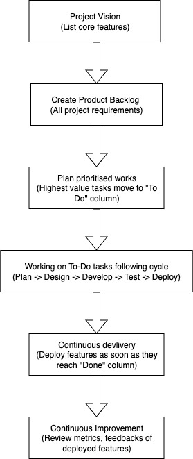

# DEV1002_Message_app

# Features
- User's and user profile.
- Edit those profiles
- Connect to other users
- Real-time messaging other privately or in group chat
- Integration of mini-games into chat


# 2. Software Development Methodologies
## 2.1. Project management 

In this project, Agile methodology will be used. This methodology is an interactive approach to manage and execute product development projects.

Agile project management breaks a project into smaller, manageable phases called sprints. Each sprint follows a cycle of planning, execution, and review, enabling teams to quickly adjust to changes and steadily refine the product. This means after every sprint, teams review, reflect and look back to see if there was anything that could be improved so they can adjust their strategy for the next sprint.

Cycle of agile methodology is demonstrated as follow:


This method requires teamwork, adaptability, and customer input to deliver consistent value throughout the project’s progression.

### Benefits of Agile methodology:

Agile is most common in app and software projects because software changes a lot in short time, and the product needs to change with it.

That’s why linear plans like Waterfall don’t fit as well. Instead, our teams pick Agile for a few big reasons:

- Agile is adaptable:

You can change direction quickly without disrupting the flow of a project. In Waterfall, each phase depends on the last, so switching plans mid-way can break the timeline.

- Agile boosts teamwork:

Agile promotes frequent, direct communication and breaking down silos. Even with remote work, the idea is the same: talk often, share context, and solve problems together.

- Agile focuses on the customer:

Software teams can gather real user feedback fast (e.g., from cloud apps). The team can collaborate with customers to understand their needs, then prioritizing the right features that focus on customers' satisfaction. When those needs change, the software team can use Agile method to change to another direction for the software, or develop new projects. 


The diagram below explains how Agile methodology will be applied in this Messaging Application project:



For examples:
- When development of main features of the app is completed and tested, app will be deployed and released to the market. These main features include: user setting up profile, users connecting to each other and messaging. After releasing, user feedbacks will be collected based on rating and reviews on app store, and app will be upgraded or debugged based on those reviews. New feature such as game playing will be developed with consideration of those feedbacks as well.
- Login system is one of prioritised features in "To Do" column. The backend developer picks the features, moves it to "In Progress" column. This feature will then be broken down into various aspects. The developer will work on this from plan, design, develop, test, review and deploy. The login feature is then considered completed, presented to users to gather feedbacks. 
- Mini-games integration will be picked up when developers have capacity and no disruption to developing other main features. 

## 2.2. Task management
Kanban is selected to be task management methodology for this project. 
Kanban is a visual framework within Agile project management. It uses a board-based system to track the status of tasks throughout the workflow. Each task is represented by a card, and workflow stages are shown as columns (e.g., Backlog, In Progress, Review, Done). As progress is made, team members move task cards from one column to the next, providing clear visibility into where each task sits in the development process.

### Benefits of Kanban method:
- Planning flexibility: 

Using Kanban help team members to concentrate on the tasks currently in progress. When a task is finished, the next item is pulled from the backlog. Because only in-progress work is affected, the leader/ product owner can freely reprioritise the backlog without disrupting the team.

By keeping the highest-priority items at the top of the backlog, the team members can confidently pull the next task from backlog and consistently deliver the most value for the project. 

- Shorter time cycles:

Cycle time is the duration from when work starts to when it ships. By reducing cycle time, teams can forecast delivery more reliably. Cross-skilled teams shorten cycle times: if only one person owns a skill, work queues behind them. Practices like code review, pairing, and mentoring to share knowledge so more people can pick up varied tasks. This lets the whole team swarm bottlenecks (e.g., developers helping with testing), keeping work flowing smoothly.

- Fewer bottlenecks:

in a team, tem multitasking and context switching between team members can slow progress. Kanban can help to control this with work-in-progress (WIP) limits, with a set limit of number of tasks to be in WTP column. This practice helps to reveal where work flow is stuck and requires focus. 

Example: in a Kanban board, Columns are set up as: To Do → In Progress → Code Review → Done. When setting Code Review WIP to 2. The low limit encourages developers to review promptly rather than let items pile up, which lowers overall cycle time.

- Visual metrics:

Continuous improvement is easier with visible data. Two standard Kanban reports help spot and remove blockers:

  *Control chart*: shows each issue item’s cycle time and the rolling average.

  
  *(Source: https://www.atlassian.com/agile/kanban)*

*Cumulative flow diagram (CFD)*: shows how many items sit in each state. A growing band in “In Progress” or “In Review” signals a blocker; unresolved, these can lead to painful merge/integration issues later.

  
   *(Source: https://www.atlassian.com/agile/kanban)*
- Continuous delivery (CD) and CI/CD:

Continuous delivery (CD) means shipping updates to customers frequently. Continuous integration (CI) is the practice of automatically building and testing small code changes throughout the day. Together, CI and CD form the CI/CD pipeline, core to DevOps for releasing faster without sacrificing quality.

Kanban aligns well with CD because both emphasize just-in-time, single-piece flow of value. By streamlining how work moves through the system, Kanban helps teams deliver changes to users quickly, increasing speed to market and product competitiveness.

Specifically, Kanban will be applied in this Dating Application project as following example:

| Stage         | Task example                | Action                       |
| :-------------| :------------------------- | :--------------------------- |
| Backlog       | Add real-time chat feature  |  This feature is prioritized |
| To Do         | Build log in authentication feature| Task is allocated to developers |
| In Progress   | Develop ERD       | Developer keep working on developing ERD  |
| Code Review   |  Peer reviews - authentication feature  | Reviewers comment, team members discussed and approve |
| Testing       |  Test message sending and receiving feature   | Verify across devices |
| Done          |  UI design   | Developer now can start build UI |

# 3. User Stories
The Message application addresses following user stories:
 
**Persona 1: Everyday User (Alex, 27, office workers)**

- As Alex, I want to create an account with a username and password so that I can securely log in and access my conversations from any device.
- As Alex, I want to search for my friends by username so I can quickly connect with people I already know. 
- As Alex,, I want to send and receive instant messages so I can stay in touch with my friends in real time.
- As Alex, I want to make new friends by getting to know them through different ways. I want to play mini-games with them in the chat so that we have more topics to talk about. 

*Reason*: With busy life working as full-time office worker, Alex does not have much time to meet his friends and family. Therefore, he needs a way to stay connected with friends in a simple and secure way.

**Persona 2: Casual Gamer (Nick, 22, student)**

- As Nick, I want to challenge my friends to play mini-games like tic-tac-toe in chat so that I can have fun while messaging without leaving the app.
- As Nick, I want the mini-games to be turn-based within the chat thread so that I can play at my own pace while still continuing the conversation.

*Reason*: Adding entertainment value and reducing boredom during casual chats.

**Persona 3: Privacy-Conscious Professional (Alice, 35, Software developer)**

- As Alice, I want to log in with a secure username and password so I know my private conversations are protected.
- As Alice, I want to see when a message has been delivered and read so I can confirm whether important information has reached my client or colleague.
- As Alice, I want the option to block or remove users so I can control who is able to contact me.

*Reason*: Alice focus on privacy and security of an application. Therefore, maintaining professionalism, protecting privacy, and ensuring reliability in communication is required for the Message application. 


# 4. Ethical Principles
The application adheres to following main ethical priciples
## 4.1. The Web should work for everyone

The messaging app will be designed to be accessible, inclusive, and usable by people with different abilities, devices, and technical literacy levels, by implementing following features and tools
- The user interface is designed and built for various devices: various types of phone, tablet, laptop and desktop. 

  Tools to be used: make wireframe using *Balsamiq,  Figma*
- Provide alt-text for profile images and icons
- Use i18n frameworks such as *i18next* to manage translations in Javascript. 
- Optimize assets for low-bandwidth environments by serving compressed images
## 4.2. Web applications should respect a user's privacy and security
Given that the app handles personal data (profiles, private conversations, and gameplay activity), security and privacy are important requirements.
- authentication to be applied for log in feature using *AuthO*, including:
  - hash, salt and apply jwt for user password to ensure security for user log in details. hash and salt is implemented using *bcrypt* package, jwt is applied using *jsonwebtoken*. 
  - multi-factor authentication to protect user account from being hacked. 
- authorisation to be applied for messaging and viewing profile feature using *AuthO*, including:
  - allow user to make privacy setting on who can view their profile, dividing in following settings. In GET requests to profile pages, the user profile setting and the user making requests are evaluated.
    - Public profiles: anyone authenticated can view.
    - Friends-only: only users with friends connection can view.
    - Private: only the owner can view full details; others see a minimal information (username and “this profile is private”)
    - Blocked: if A blocks B, neither can view the other’s profile details.

  - Messaging authorisation, with following rules:
    - only users in friend connection can make direct messages to each others
    - Only participants can read/send in a conversation.
    - Blocked relationships deny both send/read.

- Use *helmet* to secure HTTP headers, protect the application from security attacks
  - only allow content from certain domain to be exchanged in message chat. 

## 4.3. Web applications should work everywhere
The messaging app will be designed and developed to work across browsers, operating systems, and network conditions. 
- Deliver a fast, efficient experience even on slower networks and low-spec devices by minimizing loading times, optimizing resources, and improving runtime performance. This can be achieved with:
  - apply lazy loading for mini-games and chat messages
  - optimise image size
  - Asynchronous request handling for chat messages and notifications
  - performance monitoring the web app using *WebPageTest*.
- App shows consistent behavior across all major browsers (Chrome, Safari, Firefox, Edge) and platforms (Windows, macOS, Android, iOS). This can be achieved with:
  - Check compatibility of used functions and packages with different browsers during development phase, using *CanIUse.com* and MDN Compatibility Data  
  - Test in multiple web browsers using *BrowserStack*

## 4.4. Web developers should be considerate of their peers
The messaging app will be built and maintained in a way that promotes collaboration, clarity, respect. The development environment and team culture will follow best practices in documentation, testing, version control, and community engagement to ensure that all contributors can work efficiently and collaboratively. 

- Comments and code documentation are maintained throughout the development and kept up to date to make the codebase easy to understand, maintain, and extend by future developers.
This can be achieved with:
  - Inline comments for each module and function, explaining purpose, logic, and expected parameter, using *JSDoc*
  - Descriptive naming conventions for variable functions, and classes.
  - Maintain a detailed README.md and CONTRIBUTING.md file outlining detailed setup steps (e.g. install dependencies), testing commands and code expectations. 
-  Maintain a consistent, readable codebase and ensure reliability through automated testing. This can be achieved with:
  - Ensure consistent syntax and code style across the project, using *Prettier*.
  - Build automated testing using unit tests with *Jest*.
- Using structure version control with *Github*, and maintain clear conventional commit messages. Also use CODEOWNER to assign reviewers automatically for specific files and modules. 


# 5. App Architecture
## 5.1. Software Architecture Pattern
One of common software architecture pattern will be used in this application project is Event-driven architecture. 

Event-Driven Architecture (EDA) is a software design approach where system parts communicate through events—signals that something important has happened, such as a user action or a system change.

Instead of constantly checking for updates, components react to events as they occur. When one component generates an event, others that care about that event can respond immediately. This makes the system real-time, modular, and scalable, since each part can operate independently without tight connections.

That makes EDA suitable for Messaging application, which requires real-time data transfer. 

The diagram below shows how EDA works. 


*(Source: https://www.researchgate.net/figure/Event-Driven-Communication-Decoupled-Interactions-Event-publishers-often-do-not_fig2_335234337)*

Below diagram shows publisher/subscriber 

Below diagram shows an example of event-driven architecture of e-commerce website:

*(Source: https://www.geeksforgeeks.org/system-design/event-driven-architecture-system-design/)*

Another example is: implementation of EDA in an online ordering system where users are notified when their order is placed. Below is the programming example of this system in Python, includes a publisher, an event bus, and a subscriber. 
```python
# Event Bus
class EventBus:
    subscribers = {}

    @classmethod
    def subscribe(cls, event_type, subscriber):
        if event_type not in cls.subscribers:
            cls.subscribers[event_type] = []
        cls.subscribers[event_type].append(subscriber)

    @classmethod
    def publish(cls, event_type, data=None):
        if event_type in cls.subscribers:
            for subscriber in cls.subscribers[event_type]:
                subscriber.handle_event(event_type, data)


# Event Subscriber
class OrderNotificationSubscriber:
    def handle_event(self, event_type, data=None):
        if event_type == 'OrderPlaced':
            print(&quot;Notification: Your order with ID {} has been placed!&quot;.format(data['order_id']))


# Event Publisher
class OrderService:
    def place_order(self, order_id):
        # Order placement logic here
        # ...

        # Notify subscribers about the order placement
        EventBus.publish('OrderPlaced', {'order_id': order_id})


# Example Usage
if __name__ == &quot;__main__&quot;:
    # Creating instances
    order_notification_subscriber = OrderNotificationSubscriber()
    order_service = OrderService()

    # Subscribing the subscriber to the 'OrderPlaced' event
    EventBus.subscribe('OrderPlaced', order_notification_subscriber)

    # Placing an order
    order_service.place_order(order_id=123)
```
*Source: https://www.geeksforgeeks.org/system-design/event-driven-architecture-system-design/*

- Event Bus:

The EventBus class acts as the main communication channel for events within the system. It lets components subscribe to certain event types and publish events so that subscribers are notified when those events occur.
- Event Subscriber:

The ```OrderNotificationSubscriber``` class represents a listener that reacts to the OrderPlaced event. In a real-world system, this subscriber might handle tasks like sending notifications, confirmation emails, or triggering other related processes.
- Event Publisher:

The ```OrderService``` class handles creating orders. Once an order is successfully placed, it publishes an OrderPlaced event through the EventBus to alert all subscribers that the event has occurred.
- Example Usage:

In practice, the subscriber registers with the event bus using ```EventBus.subscribe``` to listen for the ```OrderPlaced``` event. When an order is created via ```order_service.place_order```, the event is published, and the subscriber’s handle_event method is automatically triggered to perform its assigned action.
## 5.2. Client/Server Architecture Explanation  

Client server architecture is made up from a few diffrent components. The first is the client, which is usually a device or aplication that requests to the server. The client can be many diffrent things: web browsers, moblie or desktop apps. The Server is a software application, or computer that processess and manages data given by clients while returning valid information.

Lastly is the internet, which is the mechanism allowing the communication betweeen the two.

Going into more detail of this process:

- First the client sends a request to the server

- The request is usually in the form of a HTTP message and is sent to the requested server's ip address via the internet

- The server then takes in and processess the request on a given port doing any backend logic that is needed to the data and prepares a response to send back to the client

- The response that is sent back can take numerous diffrent forms: webpages, json data or search results etc

- The client then renders and displays the given response


*(Source: https://blog.algomaster.io/p/client-server-architecture-explained)*

#### Key technologies used by clients and servers

- HTTP/HTTPS is the internet protocol that web browsers and servers use

- DNS (Domain Name System) is a method that turns readable domain names EG: https://www.google.com/ into an actual IP address to send the information to

- PORTS Servers accept information only on specfic ports: HTTPS is only accepted by a server listening on port 443 and HTTP is only accepted by a server listening on port 80. Its important to note that HTTPS is seen as a much more secure form of sending data as it is encrypted while HTTP is not.


*(Source: https://certera.com/blog/port-80-http-vs-port-443-https-everything-to-know-about/)*


### Authentication

Another important part of server is authentication. Ensuring that only people that are allowed to access information can access information.There are a few diffrent methods to do this. The one that we will be using in this project is User Credentials. Essentally, whenever a new user joins our website they will register as a user with a username and password. This is then saved on our servers database. Whenever this new user then tries to access their profile, we'll check the user's credentials against what we have saved in our system. Verifing that they are allowed to access the site. If they are we send them back all the corresponding info, if not we do send back and error.


*(Source: https://dev.to/ratneshjain40/beginners-guide-to-authentication-and-authorization-in-client-server-model-express-js-and-passport-n46)*

It is a complete waste of time and processing power if we make the user log in and send their credentials with each HTTP request thus we also use session ID/cookies. How this works is very similar, we stil have the user log in and confirm their credentials with the server and database. After this is completed we can create and save a session object which has an identification key and usually a primary key to identify who is communicating (usually this is a user_id), This is then saved into the server. We then send back this session ID to the client in a form of a cookie. Now with each HTTP request the webpage makes the session ID coockie is attached. Now the sever can use the server ID to check what the user is allowed to access. 

When a logout occurs both the cookie and the saved information is deleted. 


#### How the app uses client/server architecture

In this message app project, the app utilizes a client/server architecture that separates the application into two parts that work together for ensure nice and easy user experience. The client is the part users interact with (whether through a web or mobile interface), where they can log in, edit their profile, send or receive messages  and play games with other in real time, whenever the client needs information, like loading a chat or a game, updating a profile, it sends a request to the server. The server is the backend of the app and is responsible for handling all the logic, processing the requests, communicating with the database where all user data, profiles and messages are store and. managing  the user authentication. When the server receives a request, it processes it and sends back the necessary data (JSON format).


# Client/Server Communication:

The communication between the client and the server occurs throught HTTP/HTTPS request and Websockets.
HTTP/HTTPS are request and responses that used for logging in, updating profiles or registering. 
For messages in real time, the client and server maintain a continuous connection using WebSockets, which allows real-time updates without the need to refresh the page. This structure ensures that users can interact in real time while the server securely manages data and keeps everything synchronized between users.   

- What is a WebSocket?    
A **WebSocket** is a communication protocol that open a continuous connection between a website or application and the server. Unlike Web request that need constant request updates, a WebSocket maintains an open connection that ensures new information being displayed immediately without requiring to reload the page enabling instant messages.

In this project we decide to use Socket.IO, a JavaScript library that offers all the benefits of WebSockets like low-latency, bidirectional and event-based communication between a client and a server, but also provides additional benefits such as support for broadcasting messages to multiple users simultaneously, automatic reconnection and simplified event handling.


The connection can be established with different low-level transports:

HTTP long-polling: The connection will fall back to HTTP long-polling in case the WebSocket connection cannot be established.
WebSocket
WebTransport

Socket.IO will automatically pick the best available option, depending on the capabilities of the browser and the network (some networks block WebSocket and/or WebTransport connections)

Sources:
Socket.IO:
(Source: https://socket.io/docs/v4/)
How it Works? 
(Source: https://socket.io/get-started/chat)
Chat Example:
(Source: https://github.com/socketio/chat-example.git)


CAUTION:
- Although Socket.IO indeed uses WebSocket for transport when possible, it adds additional metadata to each packet. That is why a WebSocket client will not be able to successfully connect to a Socket.IO server, and a Socket.IO client will not be able to connect to a plain WebSocket server either.
- The Socket.IO library keeps an open TCP connection to the server, which may result in a high battery drain for your users. Please use a dedicated messaging platform like FCM for this use case.

# Data Distribution

The Server is responsible for managing and distributing data to clients, when a user updates their profile or sends a message, the server processes and distributes this data to the relevant users.
Lets say, when the user sends a message to group chat, the server will process and distribute that message to all the user in the group.

# Authorization

When the user logs in, the server checks that their username and password are in the stored records in the database, if they are valid the server creates a token id that identifies that user, this token is included in future request to know who's sending the requests and grant permision.

# Distribution 

The client focuses on user interaction like showing changes, displaying images and messages, handling inputs. While the server takes care of the heavy tasks like managing user data, proccesing the messages, controlling access.
This distribution allows developers to update the server without changing the client interface.

# Validation

To ensure all the data sent between the client and the server is secure. 
- The client side validation helps users to avoid mistakes like making sure required fields are filled or passwords are secure enought meeting the password security requirements.
- The server validation ensures any data received is in the correct format and safe before being processed and stored in the database. Helping to prevent errors and invalid inputs. 


