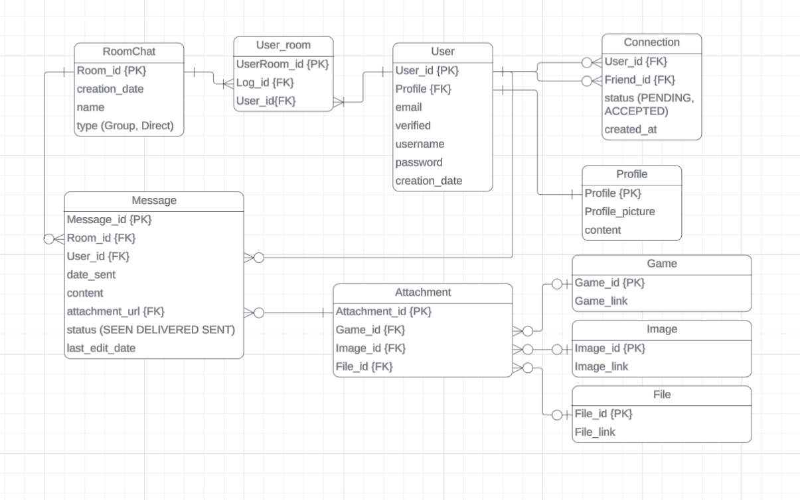

# Programming Paradigm

This project will be using Object-Oriented Programming (OOP) as its primary paradigm. We have structured our project around using objects so this makes the most sense. For example: message and message log are separate leading to easily turing these two into objects (two separate classes both with different data and methods).

```
class MessageLog:
    def __init___(self):
        self.messages = []

    def add_message(self, message):
        self.messages.append(message)

    def get_messages(self, message):
        return messages
```

```
class Message:
    def __init___(self, sender, log, content):
        self.sender = sender
        self.log = log
        self.content = content
        self.time_sent = datetime.now()
```

With this we could very easily set these objects as vars to a user object, then call **add_message( new Message("some message"))** to add to a message chain.

> Note: these examples don't take into account that to find and set data and relations, we will have to use some data-oriented programming to do this from a SQL database. This is covered in **Additional Paradigms**. The coding practice is all done using OOP thus is our main backend programming paradigm


This will also make our system very scalable - as it would be very simple to add new objects to the project - while also keeping it very modular for easier debugging and more refined code. It also means that changing one object will have less impact of the rest of the projects code

## Additional Paradigms

OOP is the primary paradigm, it does make sense to include other paradigms where useful.

- Front end | Functional 

The UI uses functional programming - using a mix of Javascript, Html and Css - to react to users clicks and hovers on the site.


- Back end | Object-Oriented (OOP)

Explained above

- Database | Data-oriented programming (DOP)

Data structured into the tables given in the ERD into a SQL database


